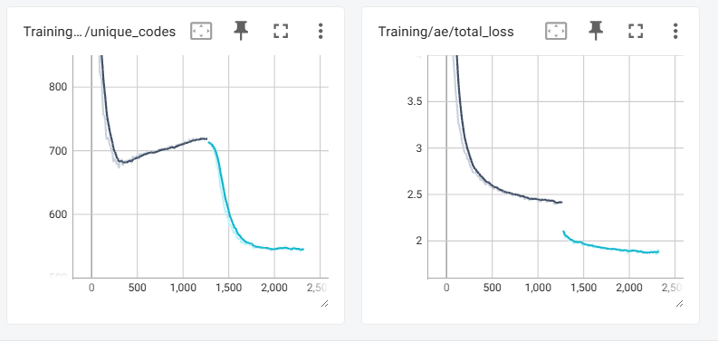

# Preventing Codebook Collapse With Codebook Dropout

### Path-dependent codebook utilization in learned-assignment vector quantizers

Eugene Raether, AI Engineer & Researcher @ Qualia Tensor LLC

---



## Abstract

Codebook collapse — the tendency of vector-quantized autoencoders to converge on a small
active subset of their codebook — is normally treated as a geometric problem and addressed
with auxiliary machinery: exponential moving average codebook updates, dead-code
reinitialization, commitment loss tuning, or periodic codebook resets.

This report describes a quantizer in which assignment is *learned* rather than geometric:
the encoder emits logits over the codebook, the forward pass takes the argmax, and the
backward pass flows through a softmax-weighted mixture via the straight-through estimator.
Under this formulation, every codebook entry receives gradient on every step. One might
expect that to be sufficient to prevent collapse. It is not — trained without intervention,
the model converges to roughly 20 active codes out of 1024.

The intervention reported here is a single scheduled hyperparameter: **codebook dropout**.
During an exploration phase, 90% of codebook entries are masked out at random on each
forward pass, and the assignment distribution renormalizes over the survivors. During a
subsequent exploitation phase, dropout is disabled. Utilization reaches approximately 720
active codes under dropout, contracts to approximately 540 once dropout is removed, and
then — critically — *stabilizes* there rather than continuing toward collapse.

The result of interest is not the peak utilization but its path dependence. Measured at
convergence under identical conditions — 0% dropout, same architecture, same objective —
the model retains ~540 active codes if it passed through an exploration phase and ~20 if it
did not. A temporary constraint applied early in training relocates the model into a basin
it subsequently occupies without ongoing pressure. No auxiliary losses, codebook resets, or
EMA updates are used.

---

## 1. Background

### 1.1 Geometric vector quantization

In the standard VQ-VAE formulation (van den Oord et al., 2017), an encoder produces a
continuous vector `z_e(x)`, which is quantized by nearest-neighbor lookup against a
codebook `E = {e_1 … e_K}`:

```
k* = argmin_k || z_e(x) - e_k ||²
z_q(x) = e_{k*}
```

The assignment is a pure function of geometry. The encoder does not select a code; it
places a point in the embedding space, and the Voronoi partition induced by the codebook
determines which code is used. Gradients reach the encoder through the straight-through
estimator, and the codebook is trained either by a codebook loss or by EMA updates against
assigned encoder outputs.

### 1.2 Codebook collapse

This formulation exhibits a well-documented failure mode variously called codebook
collapse or index collapse: a large fraction of entries are never selected, receive no
gradient, and remain permanently unused. Reported utilization in unregularized
implementations is frequently in the single-digit percentages.

The mechanism is a deadlock. A code `e_j` that lies in a region of embedding space where
no encoder output ever lands is never the argmin. Because assignment is geometric and the
codebook loss only updates assigned codes, `e_j` receives no gradient. Because it receives
no gradient, it does not move. Because it does not move, it remains outside the encoder's
output distribution. The only mechanism by which the code's fate can change is motion of
the code itself, and that motion is precisely what is gated on selection.

Compounding this, the encoder's output distribution is itself learned and tends to
contract. Early in training a small number of codes happen to be well positioned; the
encoder is rewarded for producing outputs near them; this concentrates the output
distribution further; and the region of space in which a code could plausibly be selected
shrinks. The dynamic is preferential attachment — codes that are used become more likely
to be used.

### 1.3 Standard mitigations

The established interventions all target the deadlock from outside the training dynamics:

- **EMA codebook updates** (van den Oord et al., 2017; Razavi et al., 2019) replace the
  codebook loss with an exponential moving average of assigned encoder outputs, improving
  stability but not addressing unassigned codes.
- **Dead-code reinitialization / codebook reset** detects entries whose usage falls below a
  threshold and teleports them to a randomly sampled encoder output, forcing them back into
  the active region. This is effective and widely used, but it is an explicit external
  operator with its own threshold and schedule.
- **Commitment loss weighting** constrains the encoder's outputs to stay near the codebook,
  which reduces the rate at which codes are stranded but does not recover stranded ones.
- **Reduced codebook dimensionality and L2-normalized codes** (Yu et al., 2022) improve
  utilization by making the embedding space easier to cover.

Each of these is a patch on the geometric assignment mechanism.

### 1.4 Learned-assignment quantizers

An alternative formulation removes geometry from the assignment path entirely. The encoder
emits a vector of logits `ℓ ∈ ℝ^K` over the codebook. Selection is the argmax of those
logits, and the gradient path is the softmax:

```
p = softmax(ℓ)
z_soft = Σ_k p_k · e_k
z_hard = e_{argmax(ℓ)}
z_q = z_soft + stopgrad(z_hard - z_soft)
```

The forward pass yields the hard code; the backward pass differentiates through `z_soft`.
This is the structure used by the discrete VAE in DALL·E 1 (Ramesh et al., 2021) and is
closely related to straight-through Gumbel-softmax (Jang et al., 2017; Maddison et al.,
2017) and to soft-to-hard vector quantization (Agustsson et al., 2017). In these methods
exploration is typically supplied by Gumbel noise with an annealed temperature: assignment
is stochastic and high-entropy early in training and sharpens toward deterministic argmax
over time.

The relevant property of the learned-assignment formulation is that the geometric deadlock
does not apply. Because

```
∂L/∂e_k = p_k · ∂L/∂z_soft
```

*every* codebook entry receives gradient on every step, weighted by its assignment
probability. No entry can be stranded in an unreachable region of space, because
reachability is not spatial — it is a matter of whether the encoder is willing to assign
probability mass to it.

This is a genuine structural improvement, and it is reasonable to expect it to be
sufficient. The finding below is that it is not.

---

## 2. Observation: dense gradient does not prevent collapse

Trained from initialization with no dropout and no other regularization, the
learned-assignment quantizer described above converges to approximately **20 active codes
out of 1024** — utilization comparable to unregularized geometric VQ.

This falsifies the dense-gradient hypothesis and requires a different account of the
collapse mechanism.

### 2.1 The assignment-entropy channel

Gradient magnitude to a codebook entry scales with its assignment probability `p_k`. Once
the softmax becomes peaked, non-selected entries receive gradient proportional to
probabilities on the order of 10⁻⁴, which is numerically negligible against the update
applied to the winner. The formulation is dense in principle and sparse in practice.

Worse, confidence is self-reinforcing along two coupled paths:

**Encoder path.** A peaked assignment distribution starves alternatives of gradient. The
alternatives therefore fail to improve. The encoder's preference for the incumbent is
correspondingly reinforced.

**Decoder path.** The decoder is trained only on the codes actually emitted. It becomes
specialized to the active subset, and reconstruction from an inactive code is poor. The
encoder observes this as high loss whenever it assigns mass to an inactive code, and
learns to avoid doing so. The decoder's specialization thus actively enforces the
encoder's collapse.

The second path is worth stating explicitly, because it means collapse is a *joint*
encoder–decoder failure rather than a codebook pathology. Any intervention that acts only
on the codebook — reinitialization included — leaves the decoder's specialization intact.

The correct framing, then, is that collapse in learned-assignment quantizers is not
geometric stranding but **entropy collapse of the assignment distribution**. The codes
remain perfectly reachable. The encoder simply stops reaching, and the decoder makes that
decision retroactively correct.

---

## 3. Method: codebook dropout

### 3.1 Mechanism

During the exploration phase, a random mask `m ∈ {0,1}^K` is drawn on each forward pass
with `P(m_k = 0) = 0.9`. Masked entries are removed from the assignment distribution by
setting their logits to `-∞` before the softmax:

```
ℓ'_k = ℓ_k  if m_k = 1
ℓ'_k = -∞   if m_k = 0
p' = softmax(ℓ')
```

The softmax renormalizes over the surviving ~102 entries. Both the argmax and the soft
mixture are computed over the masked distribution.

Two consequences follow.

**Gradient magnitude is decoupled from win rate.** An entry that would have received
probability 10⁻⁴ under the full distribution may receive 0.3 when the entries that
outranked it are absent. Its gradient is correspondingly large. Codes are therefore trained
in proportion to their *rank* in the encoder's preference ordering rather than their
*frequency of winning* — and rank is a far flatter distribution than winner-take-all
frequency.

**Early confidence stops being rewarded.** A sharply peaked assignment cannot be exploited
when the peak is absent from the distribution nine times out of ten. The objective favors a
deep, well-calibrated preference ordering over a spike. This is the load-bearing property:
the intervention does not merely add exploration noise, it makes premature entropy collapse
*unprofitable*.

### 3.2 An equivalent framing

At 90% dropout, the model must reconstruct its input using an arbitrary random 10% subset
of the codebook, resampled every step. Codebook spread is not encouraged under this
objective; it is required by it. A model that concentrates its representational capacity in
20 entries will, on most steps, find that most of those entries are unavailable.

This framing also explains the decoder's behavior. The decoder cannot specialize to a small
active set, because no small active set persists across steps. It is forced to remain
competent across the full codebook, which removes the decoder-side reinforcement described
in §2.1.

The relationship to standard dropout is direct — this is dropout applied to the
representational vocabulary rather than to hidden units, and the redundancy argument
carries over unchanged.

### 3.3 Relationship to ε-greedy exploration

In reinforcement-learning terms, the setup is an exploration/exploitation schedule against
a preferential-attachment process. The exploration phase forces the model to evaluate
actions (codes) it would not otherwise select; the exploitation phase allows it to act on
the resulting value estimates. Codebook dropout is the exploration operator.

It differs from the incumbent exploration operator in this family — Gumbel noise with
temperature annealing — in what it perturbs. Temperature annealing flattens the assignment
distribution uniformly, softening every preference at once. Dropout removes *specific
competitors* and forces a decision among the remainder. The former makes all choices
noisier; the latter makes substitution mandatory. These are different interventions, and
the second is more directly targeted at the failure mode: collapse is caused by particular
entries dominating, and dropout removes exactly those entries from contention on 90% of
steps.

### 3.4 Schedule

Training proceeds in two phases:

1. **Exploration.** 90% dropout at the bottleneck.
2. **Exploitation.** 0% dropout.

The cutover is a hard switch. Section 7 discusses annealed alternatives, which have not
been tested.

---

## 4. Results

All figures below are from a single training run on FFHQ at 512×512 with a 1024-entry
codebook. They should be read as a single observation, not a characterized result; §6
addresses this directly.

### 4.1 Utilization trajectory

| Phase | Dropout | Step range | Active codes |
|---|---|---|---|
| Initialization | 90% | 0 | 1024 |
| Early pruning | 90% | 0 → ~300 | 1024 → ~680 |
| Exploration (recovery) | 90% | ~300 → cutover | ~680 → ~720 |
| Exploitation | 0% | post-cutover | ~720 → ~540, stable |

Note that the first three rows are measured under 90% dropout and the fourth under 0%. The
two regimes are not directly comparable, and the ~720 peak should be read as utilization
*under constraint* rather than as a converged result.

An initial contraction to ~680 occurs almost immediately. This is expected: at
initialization the codebook is random and most entries are poor, so early training prunes
them.

The behavior that follows is the notable part. Rather than continuing toward collapse,
utilization **reverses and climbs** to ~720, and the trend had not saturated when the
exploration phase was ended. Most published collapse curves are monotone; recovery after an
initial drop is not the typical shape. The interpretation is that once exploration pressure
is applied, marginal codes begin receiving substantial gradient, drift toward useful values,
and become genuinely competitive rather than nominally present. Utilization is a lagging
indicator of that drift.

**The post-cutover contraction.** Removing dropout costs approximately 180 codes: ~720
contracts to ~540, where it stabilizes. This is not a failure of the method, and it is the
outcome the mechanism predicts.

Under 90% masking, a code can win simply because everything that outranked it was absent
from that step's distribution. Some fraction of the 720 were therefore being selected on the
strength of their competitors' absence rather than on their own merit. Removing the mask
restores full competition, those codes stop winning, and they fall out of the active set.
What survives is the subset that is genuinely preferred when every alternative is available.

The ~540 figure is thus the more meaningful number of the two, and the one that should be
quoted in comparisons. The ~720 measures the codebook the model was forced to maintain; the
~540 measures the codebook it chooses to use.

The stabilization is the load-bearing observation. Contraction from 720 to 540 is a 25%
reduction; contraction from 720 to 20 would be collapse. The model does the former and stops.
Section 4.4 addresses why.

### 4.2 Loss discontinuity at cutover

The total loss drops sharply and immediately at the transition from 90% to 0% dropout —
faster than any gradient-descent improvement could account for.

This is diagnostic rather than surprising. It indicates that during the exploration phase
the model's preference ordering was already well-calibrated and its top choice was usually
correct; it simply could not act on that preference, because the top choice was masked out
with probability 0.9. The magnitude of the drop is a measure of how much of the exploration
phase's loss was attributable to the handicap rather than to the model's representational
quality.

Put differently: the exploration phase was solving a strictly harder problem, and the
cutover reveals how much harder.

### 4.3 The path-dependence result

Both conditions below are measured at convergence under 0% dropout, so the comparison is
like for like:

| Condition | Active codes at convergence (0% dropout) |
|---|---|
| 0% dropout from initialization | ~20 |
| 90% dropout → 0% dropout | ~540 |

Identical architecture. Identical objective. Identical dropout rate at the point of
measurement. A **27× difference** in codebook utilization determined entirely by training
history.

This is the central finding of this report. It says that the codebook has (at least) two
stable configurations under the same loss, and that which one the model occupies is not
determined by the objective. It is determined by the path taken through parameter space.

The comparison deliberately uses ~540 rather than the ~720 peak. Quoting 720 against 20
would be comparing a constrained-regime measurement against a converged one and would
overstate the effect. The honest number is 27×, and 27× is a large enough effect that it
does not need help.

### 4.4 Why the contraction halts

The question §4.1 leaves open is why utilization settles at ~540 rather than continuing to
~20. Nothing enforces spread after cutover — the exploration pressure is gone, and the
preferential-attachment dynamic described in §2.1 is free to operate. It does operate, for
about 180 codes, and then stops.

The mechanism follows from §2.1. Preferential attachment amplifies an *existing* asymmetry;
it requires an initial imbalance to compound. The collapse trajectory in the 0%-from-init
run begins from a random codebook in which a handful of entries are accidentally better than
the rest, and that accident is what gets amplified.

At cutover the model presents no comparable asymmetry. Roughly 540 codes are in genuine
competitive use in every minibatch, all of them receive substantial gradient, and —
critically — the decoder is already competent at reconstructing from all of them. The
decoder-side reinforcement loop that drove the original collapse has nothing to amplify: an
entry does not produce poor reconstructions merely because it is used less often, so the
encoder is never taught to abandon it.

What the contraction removes is the marginal 180 identified in §4.1 — entries whose apparent
utility was an artifact of masking. Those had no independent claim on the representation and
their removal is the model correcting an artifact, not collapsing. Once they are gone, the
remaining set is mutually competitive and there is no gradient toward further pruning.

Two configurations are therefore stable under the same objective, and the basin the model
occupies is fixed early. This is the mechanistic content of the path-dependence result.

The practical consequence appears in §8: because contraction is real but bounded, the loss
minimum after cutover is the correct stopping point.

### 4.5 Reconstruction quality

PSNR over 1000 held-out samples, evaluated at multiple input scales:

```
downscale 1×:   27.062
downscale 2×:   25.203
downscale 4×:   23.316
downscale 8×:   20.898
downscale 16×:  19.178
unique codes:   541
```

Compression ratio at full resolution: approximately 75×, computed as 4096 codes × 9 bits
against a ~350 kB PNG reference.

Two notes on these numbers.

**The 541 figure is the converged utilization.** It agrees with the post-cutover
stabilization described in §4.1 and is the same quantity reported there as ~540. It is not a
sampling artifact and does not indicate any inference-time behavior distinct from training —
the model settles at this utilization during the exploitation phase and holds it. The ~720
peak belongs to the constrained regime and is not the figure to compare against.

**Utilization should be reported as perplexity.** Unique-code count is the weaker of the two
available metrics. Perplexity — `exp(H(p))` where `p` is the marginal usage distribution over
codes — is standard in this literature and strictly more informative. A raw count treats an
entry used 0.001% of the time identically to one used 10% of the time; perplexity weights by
actual usage and yields an effective codebook size. A model with 541 unique codes at
perplexity 80 and one with 541 unique codes at perplexity 450 are not comparable, and the
count alone cannot distinguish them. This matters especially for the §4.3 comparison: the
27× gap is stated in unique codes, and the gap in *effective* codebook size could be larger
or smaller.

**The compression ratio is conservative.** The 9 bits per code figure is `log₂(1024)` — the
cost of a uniformly distributed symbol over the full alphabet. Actual usage is skewed, and
the true cost of a symbol stream is its entropy, not the logarithm of its alphabet size.
Applying an arithmetic coder over the index stream should reduce the effective rate to
roughly 7–8 bits per code, moving the ratio to approximately 85–95×. This is free
compression already latent in the trained model.

---

## 5. Interpretation

The finding is best stated as a claim about optimization rather than about vector
quantization specifically:

> Codebook utilization is a path-dependent property of the trained model, not a property of
> the objective. A temporary constraint during early training relocates the model to a basin
> of attraction it subsequently occupies without ongoing pressure.

Three points follow.

**Collapse is not a failure of the loss.** The 20-code and 540-code configurations are both
reachable under the identical objective. The loss does not prefer collapse; the *dynamics*
prefer it, because preferential attachment is a positive-feedback process and gradient
descent has no mechanism for escaping one.

**Interventions can be temporary.** Dead-code reinitialization runs throughout training as a
standing external operator. If the basin argument holds, an exploration phase is sufficient
and the intervention can be removed once the model is inside the target basin. This is a
meaningfully cheaper and simpler class of solution.

**The finding should transfer.** The mechanism identified in §2.1 — entropy collapse of a
learned assignment distribution, reinforced by decoder specialization — is a property of the
logit-based formulation, not of this particular model. Any architecture in the dVAE /
straight-through Gumbel-softmax family shares it. Codebook dropout is applicable wherever
assignment is learned and the codebook is a discrete set.

---

## 6. Limitations

This section is not pro forma. The evidence base for the claims above is one training run
per condition on one dataset at one codebook size, and the limitations are load-bearing.

**No baseline against annealed Gumbel-softmax.** This is the most significant gap.
Temperature-annealed Gumbel-softmax is the incumbent exploration mechanism for exactly this
architecture and exactly this failure mode. Without a matched-compute comparison, the claim
supported by the data is "codebook dropout works," not "codebook dropout works better than
the standard approach." The argument in §3.3 for why dropout should be better targeted is a
mechanistic hypothesis, not a result.

**Single configuration.** One dataset (FFHQ), one codebook size (1024), one dropout rate
(90%), one schedule (hard cutover). The sensitivity of the result to any of these is
unmeasured. In particular, 90% is a strong intervention and the useful range is unknown.

**Single seed per condition.** The 20-code figure and the 540-code figure are each one run.
Collapse dynamics are known to be seed-sensitive, and the effect size claimed (27×) is large
enough that it would survive substantial variance — but that is an assumption, not a
measurement.

**No comparison to dead-code reinitialization.** The most common practical fix is untested
here, both alone and in combination.

**Utilization metric.** As noted in §4.5, unique-code count is the weaker of the two
available metrics. The 27× figure is stated in unique codes; the corresponding gap in
effective codebook size is unmeasured.

**Post-cutover horizon.** Utilization is reported as stable at ~540, but stability is
established over the training window that was run, not asymptotically. A very slow ongoing
decline would not be distinguishable from stability at this horizon.

**Novelty is unverified.** The architecture (logit emission, argmax forward, softmax
backward via STE) is established prior art — this is essentially the dVAE formulation. The
contribution claimed is narrower: *dropout as the exploration operator within that
formulation*, and the path-dependence result that follows. The VQ literature is large and
this has not been searched systematically. A literature review should precede any external
claim of novelty.

---

## 7. Proposed experiments

Ordered by value per unit of compute.

**1. Annealed Gumbel-softmax baseline at matched compute.** Closes the largest gap in §6.
Report utilization, perplexity, and reconstruction PSNR against the same budget.

**2. Dropout rate sweep.** {50%, 75%, 90%, 95%} through the exploration phase. Establishes
whether 90% is near an optimum or merely a value that worked, and whether the effect is
graded or threshold-like. Threshold behavior would be the more interesting outcome and would
sharpen the mechanistic account.

**3. Annealed dropout schedule.** 90% → 50% → 0% versus the hard cutover. The loss
discontinuity in §4.2 indicates the hard switch leaves value on the table; a gradual release
may reach the exploitation regime without the abrupt transition. The existing "halt at the
loss minimum" heuristic already implies the schedule is doing real work.

**4. Perplexity reporting throughout.** Recompute utilization as perplexity for all existing
runs. Cheap, and makes every other number comparable to the published literature.

**5. Combination with dead-code reinitialization.** Determines whether the two interventions
are redundant or complementary. If dropout alone matches reinit, that is a simplification
worth stating; if they compose, that is worth stating too.

**6. Codebook size scaling.** {512, 1024, 4096, 8192}. Whether the utilization *fraction*
holds as K grows is the question that determines whether this is useful at scale.

**7. Entropy coding the index stream.** Not an ablation — a free improvement to the reported
compression ratio, per §4.5.

**8. Long-horizon stability probe.** Utilization stabilizes at ~540 over the window
observed. Extending the exploitation phase substantially would distinguish true stability
from a very slow decline, and would confirm that ~540 is a fixed point rather than a
plateau.

**9. Cutover timing sweep.** Vary the exploration phase length and measure post-cutover
utilization. §4.1 reports the exploration curve had not saturated when it was ended, which
implies a longer phase yields a higher peak — but the quantity that matters is the
post-cutover figure, and whether the two move together is unknown. This directly tests the
basin argument: if late cutover produces a higher stable floor, exploration duration
determines which basin is reached.

---

## 8. Practical guidance

For practitioners working with learned-assignment quantizers, the operational summary is:

- Train in the high-dropout exploration regime for as long as the compute budget allows.
  Utilization gains accrue throughout this phase and had not saturated when this run was
  halted.
- Expect to lose roughly a quarter of peak utilization at cutover. This is the model
  discarding codes that were only competitive because their rivals were masked, and it is
  the expected behavior rather than a regression. Budget for it: if the target is ~540
  usable codes, the exploration phase needs to reach roughly 700.
- Cut over to 0% dropout and monitor total loss. Halt at the minimum. Utilization contracts
  and then holds, so the loss minimum is the point at which the exploitation gain has been
  realized and further training buys nothing.
- Larger batch sizes and more tokens through the bottleneck both improve utilization
  independently, by increasing the number of codes exercised per gradient step.
- Report perplexity, not unique-code count, and state the sample size.

---

## 9. Related work

**Vector-quantized autoencoders.** van den Oord et al. (2017) introduce VQ-VAE with
geometric nearest-neighbor assignment, the commitment loss, and the straight-through
estimator. Razavi et al. (2019) extend to hierarchical codebooks and popularize EMA
codebook updates.

**Codebook utilization.** Dead-code reinitialization and codebook reset appear in numerous
implementations as standard practice. Yu et al. (2022, ViT-VQGAN) improve utilization via
low-dimensional and L2-normalized codebook entries. These approaches operate on codebook
geometry; the present work operates on the assignment distribution.

**Learned assignment.** Ramesh et al. (2021) use a logit-emitting discrete VAE for DALL·E 1.
Jang et al. (2017) and Maddison et al. (2017) introduce the Gumbel-softmax / Concrete
relaxation with temperature annealing, which is the standard exploration mechanism in this
family. Agustsson et al. (2017) anneal from soft to hard assignment for compression.

**Dropout.** Srivastava et al. (2014). The redundancy argument transfers directly; the
application to a discrete representational vocabulary rather than to hidden units is the
adaptation made here.

**Positioning.** The architecture is not novel. The claimed contributions are (i) the
observation that dense softmax gradient is insufficient to prevent collapse in
learned-assignment quantizers, with the entropy-collapse mechanism in §2.1 as the
explanation; (ii) codebook dropout as an exploration operator; and (iii) the path-dependence
result in §4.3. Of these, (iii) is the most transferable and (i) is the most likely to be
already known somewhere in the literature.

---

## References

Agustsson, E., Mentzer, F., Tschannen, M., Cavigelli, L., Timofte, R., Benini, L., & Van
Gool, L. (2017). Soft-to-Hard Vector Quantization for End-to-End Learning Compressible
Representations. *NeurIPS*.

Jang, E., Gu, S., & Poole, B. (2017). Categorical Reparameterization with Gumbel-Softmax.
*ICLR*.

Maddison, C. J., Mnih, A., & Teh, Y. W. (2017). The Concrete Distribution: A Continuous
Relaxation of Discrete Random Variables. *ICLR*.

Ramesh, A., Pavlov, M., Goh, G., Gray, S., Voss, C., Radford, A., Chen, M., & Sutskever, I.
(2021). Zero-Shot Text-to-Image Generation. *ICML*.

Razavi, A., van den Oord, A., & Vinyals, O. (2019). Generating Diverse High-Fidelity Images
with VQ-VAE-2. *NeurIPS*.

Srivastava, N., Hinton, G., Krizhevsky, A., Sutskever, I., & Salakhutdinov, R. (2014).
Dropout: A Simple Way to Prevent Neural Networks from Overfitting. *JMLR*.

van den Oord, A., Vinyals, O., & Kavukcuoglu, K. (2017). Neural Discrete Representation
Learning. *NeurIPS*.

Yu, J., Li, X., Koh, J. Y., Zhang, H., Pang, R., Qin, J., Ku, A., Xu, Y., Baldridge, J., &
Wu, Y. (2022). Vector-quantized Image Modeling with Improved VQGAN. *ICLR*.

